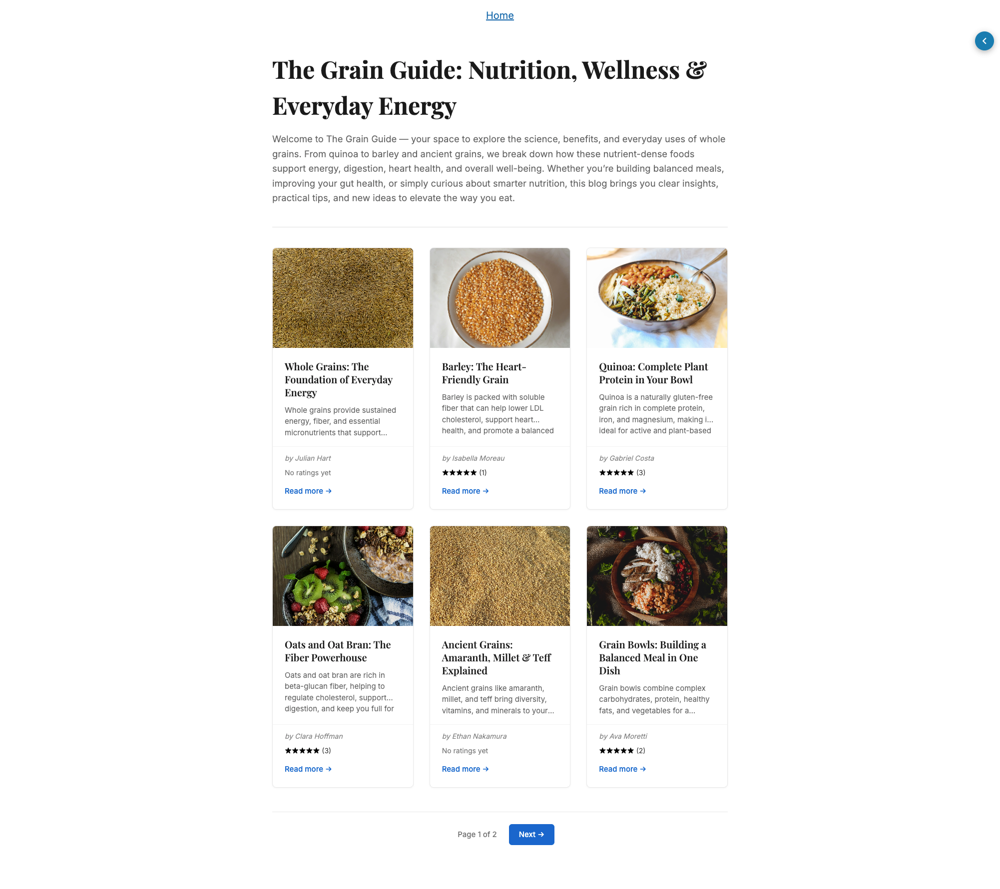
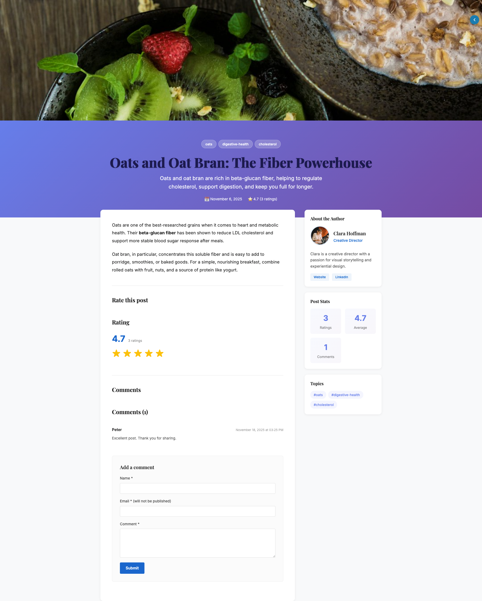

# Blog Factory Module

A modern, full-featured blog application for Jahia DX, built with React Server Components and interactive client islands. This module provides a complete blogging platform with content authoring, user engagement features (ratings and comments), and multiple responsive views.

## Features

- **📝 Content Authoring**: Rich blog posts with titles, excerpts, content, hero images, tags, and author attribution
- **⭐ User Engagement**: Post ratings and comment system powered by the separate blog-service module
- **🎨 Multiple Views**: Default list, cards grid, and full-page layouts with responsive design
- **🏝️ Island Architecture**: Server-side rendering with selective client-side hydration for interactive features
- **🖼️ Media Support**: Hero images for full posts, thumbnails for card views
- **👤 Author Profiles**: Dedicated author content type with bio, role, avatar, and social links
- **🌍 Internationalized**: Full support for English, French, Spanish, and German
- **♿ Accessible**: Semantic HTML with proper ARIA attributes and Schema.org markup

## Prerequisites

### Required Modules

- **Jahia DX 8.2+**
- **blog-service module** (separate deployment) - Provides GraphQL API for:
  - Post ratings (create, retrieve aggregated stats)
  - Comments (create, retrieve, moderate)
  - UGC storage in Live workspace

### Development Tools

- Node.js 18+
- Yarn 3.x
- Docker and Docker Compose

## Getting Started

### 1. Install Dependencies

```bash
yarn install
```

### 2. Configure CSRF Token

Create a `.env` file in the project root:

```bash
VITE_CSRF_TOKEN=your-csrf-token-here
```

This token will be embedded in the client bundle at build time and used for GraphQL mutations to blog-service.

### 3. Start Development Environment

```bash
# Start Jahia in Docker
docker compose up --wait

# Deploy blog-service module first (required)
# Upload and deploy blog-service.jar to Jahia

# Start development mode with hot reload
yarn dev
```

### 4. Build and Deploy

```bash
# Build production bundle
yarn build

# Create deployable package
yarn package

# Upload dist/package.tgz to Jahia
```

## Commands

Available Yarn scripts for development and deployment:

| Category     | Script                | Description                                                        |
| ------------ | --------------------- | ------------------------------------------------------------------ |
| Build        | `build`               | Builds client islands and SSR bundle for production                |
| Build        | `deploy`              | Pushes the build artifact to a running Jahia instance              |
| Development  | `dev` (alias `watch`) | Watches for changes and rebuilds the module automatically          |
| Code quality | `format`              | Runs Prettier (code formatter) on all source files                 |
| Code quality | `lint`                | Runs ESLint (linter) to check code quality                         |
| Utils        | `clean`               | Removes all build artifacts from dist/ folder                      |
| Utils        | `package`             | Creates a deployable `.tgz` archive in dist/package.tgz            |
| Utils        | `watch:callback`      | Custom callback executed after each successful build in watch mode |

## Architecture

### Module Structure

```
blog-factory/
├── src/
│   ├── components/
│   │   ├── Blog/              # Blog container component
│   │   ├── BlogFactory/       # Blog factory component
│   │   ├── BlogList/          # List views (default, cards.server.tsx)
│   │   │   ├── BlogList.server.tsx      # Default list view
│   │   │   ├── cards.server.tsx         # Card grid view
│   │   │   └── CardRating.client.tsx    # Rating display island
│   │   ├── BlogPost/          # Post views
│   │   │   ├── default.server.tsx       # Summary view
│   │   │   ├── fullPage.server.tsx      # Full post with hero
│   │   │   └── RatingStats.client.tsx   # Stats display island
│   │   ├── AuthorCard/        # Author profile component
│   │   ├── Rating/            # Interactive rating widget
│   │   │   └── Rating.client.tsx        # 5-star rating island
│   │   ├── CommentsSection/   # Comment system
│   │   │   └── Comments.client.tsx      # Comment form/list island
│   │   └── layout/            # Layout components (CardGrid, HeroBanner, etc.)
│   ├── services/
│   │   └── blogService.ts     # GraphQL client for blog-service
│   ├── graphql/
│   │   └── blog.graphql       # GraphQL schema definitions
│   ├── hooks/
│   │   ├── useAuth.ts         # Authentication hook
│   │   └── useHydration.ts    # Client hydration utilities
│   ├── lib/
│   │   ├── graphql.ts         # GraphQL utilities
│   │   ├── jcrMappers.ts      # JCR property mappers
│   │   └── serverUtils.ts     # Server-side helpers
│   └── types/
│       └── content.ts         # TypeScript type definitions
├── settings/
│   ├── definitions.cnd        # JCR content type definitions
│   ├── locales/               # i18n translations (en, fr, es, de)
│   └── resources/             # Resource bundles (en, fr, es, de)
└── docker/                    # Docker configuration for development
```

### Island Architecture

This module uses the **Island Architecture** pattern:

- **Server Components** (`.server.tsx`): Render on the server, access JCR directly, no client JavaScript
- **Client Islands** (`.client.tsx`): Hydrate on the client, handle interactions, fetch from blog-service GraphQL API

**Key Islands:**

- `Rating.client.tsx` - Interactive 5-star rating widget
- `Comments.client.tsx` - Comment submission form and approved comments list
- `RatingStats.client.tsx` - Display rating statistics (inline and sidebar variants)
- `CardRating.client.tsx` - Compact rating display for card views

### Integration with blog-service

The blog-service module provides a GraphQL API using the wrapper pattern:

```graphql
query {
  blog {
    getRating(postId: "uuid") {
      averageRating
      ratingCount
      totalRating
    }
    getComments(postId: "uuid") {
      id
      authorName
      body
      status
      created
    }
  }
}

mutation {
  blog {
    ratePost(postId: "uuid", rating: 5) {
      success
      message
    }
    createComment(postId: "uuid", authorName: "...", body: "...") {
      success
      message
    }
  }
}
```

All UGC (ratings, comments) is stored in the **Live workspace** at:

- `/sites/{site}/contents/ugc/blogs/{postId}/ratings/{userId}`
- `/sites/{site}/contents/ugc/blogs/{postId}/comments/{commentId}`

## Content Types

### blognt:blog

Main container for blog posts with pagination support.

**Properties:**

- `jcr:title` - Blog title
- `description` - Rich text description
- `pageSize` - Posts per page (default: 10)

**Child nodes:** `blognt:post`

### blognt:post

Individual blog post with full content and metadata.

**Properties:**

- `jcr:title` - Post title
- `excerpt` - Short summary
- `content` - Rich text content
- `datePublished` - Publication date
- `dateModified` - Last modification date
- `author` - Reference to blognt:author
- `image` - Reference to hero/thumbnail image
- `j:tagList` - Tags (from jmix:tagged)
- `allowComments` - Enable/disable comments (from blogmix:commentable)

**Mixins:**

- `jmix:editorialContent` - Editorial workflow
- `jmix:mainResource` - Main resource type
- `jmix:structuredContent` - Structured content support
- `jmix:tagged` - Tagging support
- `blogmix:commentable` - Comment enablement

**Note:** Ratings and comments are NOT stored as JCR properties. They are managed by blog-service in the Live workspace.

### blognt:author

Content author profile.

**Properties:**

- `jcr:title` - Author name
- `bio` - Rich text biography
- `role` - Job title/role
- `avatar` - Reference to profile image
- `socialLinks` - Array of social media URLs

### blognt:comment

Comment content type (for reference only - actual comments stored by blog-service).

**Properties:**

- `authorName` - Commenter name
- `authorEmail` - Commenter email
- `body` - Comment text
- `created` - Creation timestamp
- `status` - Approval status (pending, approved, rejected)
- `post` - Reference to blog post

## Available Views

### Blog Container Views

- **default** - Standard list view with post summaries
- **cards** - Responsive grid of card-based post previews with thumbnails

### Blog Post Views

- **default** - Summary view for list contexts
- **fullPage** - Full article view with hero image, sidebar stats, author card, rating widget, and comments

### Author Card Views

- **default** - Profile card with avatar, bio, role, and social links (3-row layout)

### Screen shots

- **Blog Posts List**
  

- **Blog Post**
  

## Usage

### Creating a Blog

1. In Jahia Content Editor, create a new `Blog` content item
2. Set the title and description
3. Configure page size if needed (default: 10 posts per page)

### Creating Blog Posts

1. Inside a Blog container, create a new `Blog Post`
2. Fill in required fields:
   - Title
   - Excerpt (summary)
   - Content (rich text)
   - Publication date
3. Optionally add:
   - Hero image (displayed in fullPage view and as thumbnail in cards)
   - Tags (for categorization)
   - Author reference
4. Publish the post

### Creating Authors

1. Create a `Blog Author` content item
2. Fill in:
   - Name (title)
   - Bio (rich text)
   - Role (e.g., "Senior Writer", "Guest Contributor")
   - Avatar image
   - Social links (URLs to Twitter, LinkedIn, etc.)
3. Reference the author in blog posts

### Configuring Comments

Comments are enabled by default for all posts. To disable:

1. Edit the blog post
2. Uncheck the "Allow Comments" property
3. Save changes

Comments require moderation through the blog-service API. Only approved comments are displayed to visitors.

## Development Notes

### CSRF Token Flow

1. Token defined in `.env` as `VITE_CSRF_TOKEN`
2. Vite embeds token at build time via `define` config
3. Client islands inject token into `window.contextJsParameters`
4. GraphQL mutations send token in `X-CSRF-Token` header
5. blog-service validates token before processing mutations

### Data Flow

- **Content (posts, authors)**: Stored in JCR, read by server components
- **UGC (ratings, comments)**: Stored in Live workspace by blog-service
- **Client islands**: Fetch UGC on mount via GraphQL, update local state

### Styling

- Modular CSS with `.module.css` files
- Responsive breakpoints: 480px, 768px, 1024px
- CSS variables for consistent theming
- Mobile-first approach

### Internationalization

The module includes complete translations for four languages:

**Supported Languages:**

- 🇬🇧 English (en)
- 🇫🇷 French (fr)
- 🇪🇸 Spanish (es)
- 🇩🇪 German (de)

**Translation Files:**

- **Locale files** (`settings/locales/*.json`): UI strings, messages, labels
- **Resource bundles** (`settings/resources/blog-factory_*.properties`): Content type labels, tooltips, view descriptions

All user-facing text, content type definitions, and administrative labels are fully translated.

## Troubleshooting

### Ratings/Comments Not Appearing

1. Verify blog-service module is deployed and active
2. Check browser console for GraphQL errors
3. Verify CSRF token is set in `.env` and embedded in bundle
4. Check blog-service logs for validation errors

### Images Not Displaying

1. Ensure images are uploaded to JCR
2. Verify image picker references are saved
3. Check image node has `jmix:image` mixin
4. Confirm `getUrl()` method returns valid path

### Build Errors

1. Clear node_modules: `rm -rf node_modules && yarn install`
2. Clean build artifacts: `yarn clean`
3. Rebuild: `yarn build`
4. Check for TypeScript errors: `yarn lint`

## License

This module is provided as-is for demonstration and development purposes.

## Resources

- [Jahia Academy](https://academy.jahia.com/)
- [JavaScript Modules Documentation](https://github.com/Jahia/javascript-modules)
- [CND Format Reference](https://github.com/Jahia/javascript-modules/tree/main/docs/3-reference/1-cnd-format)
- [Island Architecture Pattern](https://jasonformat.com/islands-architecture/)
